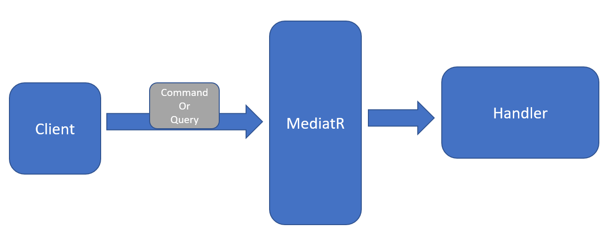
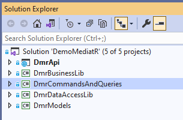
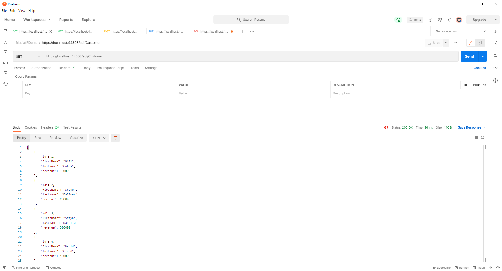
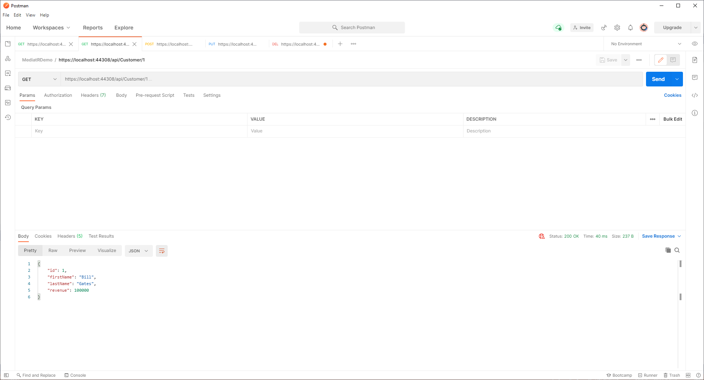
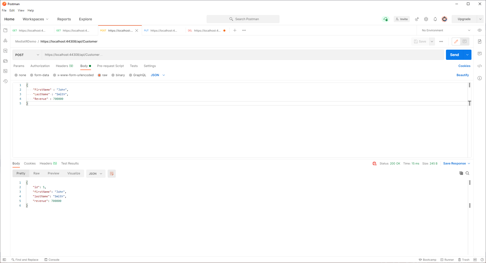
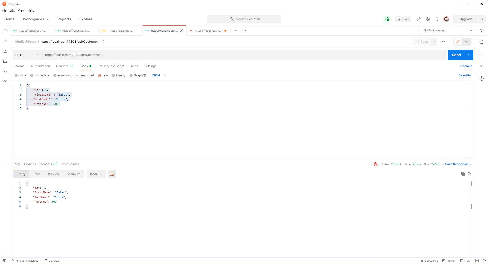
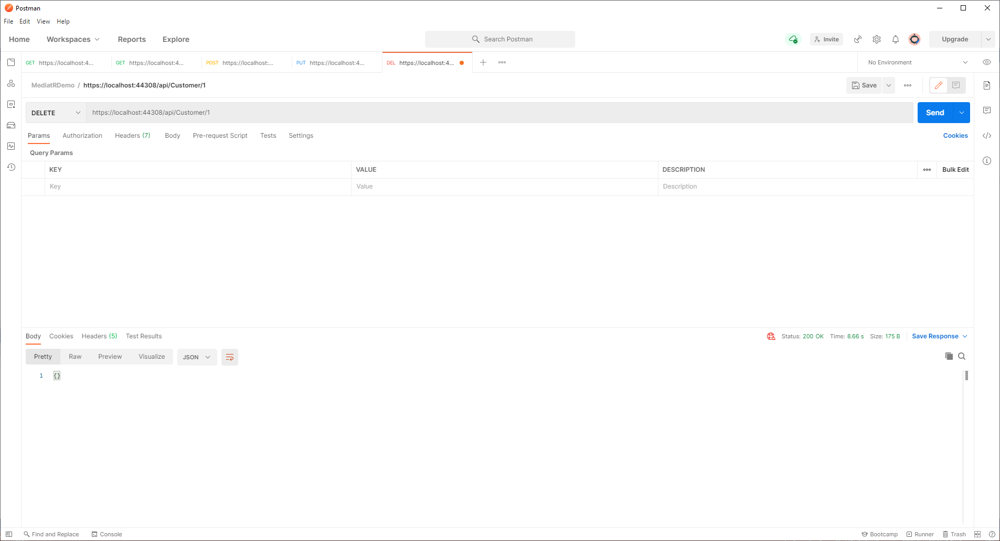

# MediatR Sample Code

## CQRS and the Mediator Pattern

The Command Query Responsibility Segregation (CQRS) pattern suggests separating data Read from data Write operations in your application. This can maximize your app's performance, scalability, and security.

The Mediator pattern one way to accomplish this; it can help to drive your application toward CQRS by using a separate component (a "mediator") to select the appropriate component to perform a given functions. In the context of CQRS, the Mediator can ensure that Data Reads are performed by one class, while Data Writes are performed by a different class.

[MediatR](https://github.com/jbogard/MediatR) is an open source project that allows you to implement the Mediator pattern. MediatR decouples business logic from the client, giving you the flexibility to call your business logic from many different clients. The client takes no dependency on the business logic and the business logic class does not need to rely on any client technology, such as HTTP.

## Concepts

Here are the basic concepts used by MediatR:

### Handlers

A Handler is a class and method that contains the code to handle the required business logic.

### Commands and Queries

Commands and Queries contain data that is passed to a MediatR handler, so that the handler can do its work. Commands are used for handlers that update data, while Queries are used for handlers that read data.

### MediatR

The engine that manages routing Commands and Queries to the correct Handler

### Models

A Model is not specifically a MediatR concept; it is used by many applications. A model is a class designed to hold stateful data in memory.

Fig. 1 shows how MediatR handles this communication.



Fig.1

## Solution

I will walk you through a sample application that reads and writes data. For this sample, I will create 5 projects.

Project Name | Project Type | Purpose | Project Dependencies
--- | --- | --- | ---
DmrDataAccessLib | Class Library | Read and write data. In this example, we will use in-memory data. | DmrModels
DmrModels | Class Library | Data models that hold stateful data | None
DmrCommandsAndQueries | Class Library | MediatR Commands and Queries | DmrModels
DmrBusinessLib | Class Library | Business logic. Contains MediatR handler classes | DmrCommandsAndQueries, DmrDataAccessLib, DmrModels
DmrClientApi | Web API | Web services that accept requests and send Commands and Queries to MediatR | DmrBusinessLib, DmrCommandsAndQueries, DmrModels

These projects in this solution are shown in Fig. 1



Fig. 2

You may choose to structure your application differently than I have. For example, you might combine the business logic, data access, and models into a single project. Or you might choose to split your application along vertical slices, so that data reads are in a different project than data writes. The latter choice would make it possible to scale these operations independently.

## Create Required Model(s)

I like to keep my models in their own separate project, so they can be referenced by many different projects.

Create a class library and add a class to it that represents your model. In our example, we will create a Customer model that stores the following information:  Unique id, First Name, Last Name, and Revenue

Below is the code for this class:

```C#
public class Customer
{
    public int Id { get; set; }
    public string FirstName { get; set; }
    public string LastName { get; set; }
    public Double Revenue { get; set; }
}
```

## Data Access Layer

Create a class library to handle updating and reading to/from your persistent data store. Set a project reference to the Models class library created above.

For this example, I will use an in-memory database. This makes my sample code simple, but a real-world business application would probably connect to a persistent data store, such as SQL Server, Oracle, or CosmosDB.

I prefer creating and implementing an interface for these operations, so I created the following two files.

```C#
public interface IDataAccess
{
    List<Customer> GetCustomers();
    Customer GetCustomer(int id);
    Customer AddCustomer(Customer customer);
    void DeleteCustomer(Customer customer);
    void DeleteCustomer(int id);
    Customer UpdateCustomer(Customer customer);
}
```

```C#
public class DataAccess : IDataAccess
{
    private List<Customer> _customers;

    public DataAccess()
    {
        _customers = new List<Customer>();
        _customers.Add(new Customer { Id = 1, FirstName = "Bill", LastName = "Gates" });
        _customers.Add(new Customer { Id = 2, FirstName = "Steve", LastName = "Ballmer" });
        _customers.Add(new Customer { Id = 3, FirstName = "Satya", LastName = "Nadella" });
        _customers.Add(new Customer { Id = 4, FirstName = "David", LastName = "Giard" });
    }

    public List<Customer> GetCustomers()
    {
        return _customers;
    }

    public Customer GetCustomer(int id)
    {
        var customer = _customers.FirstOrDefault(x => x.Id == id);
        return customer;
    }


    public Customer AddCustomer(Customer customer)
    {
        if (customer.Id == 0)
        {
            int nextId = _customers.Max(c => c.Id) + 1;
            customer.Id = nextId;
        }
        _customers.Add(customer);
        return customer;
    }

    public Customer AddCustomer(string firstName, string lastName)
    {
        int nextId = _customers.Max(c => c.Id) + 1;
        var customer = new Customer() {Id=nextId, FirstName = firstName, LastName = lastName };
        _customers.Add(customer);
        return customer;
    }

    public void DeleteCustomer(Customer customer)
    {
        _customers.Remove(customer);
    }

    public void DeleteCustomer(int id)
    {
        var customer = _customers.FirstOrDefault(x => x.Id == id);
        _customers.Remove(customer);
    }

    public Customer UpdateCustomer(Customer customer)
    {
        throw new NotImplementedException();
    }
}
```

## Command and Query classes

Create a new class library and reference the MediatR NuGet package. Also add a reference to the Models project.

Notice that each class inherits from IRequest\<T\> and that a generic object type is passed as T. IRequest is part of MediatR and the generic object represents the type of data that will be returned by the handler. It also will help find the correct handler when we pass the Query to MediatR.

### Commands

Add a Command class for adding a new customer.

The code is below:

```C#
public class AddCustomerCommand : IRequest<Customer>
{
    public string FirstName { get; set; }
    public string LastName { get; set; }
    public AddCustomerCommand(string firstName, string lastName)
    {
        FirstName = firstName;
        LastName = lastName;
    }
}
```

Notice that the class inherits from IRequest\<T\> and that a generic object type is passed as T. This generic object type represents the data that is passed to the MediatR handler.

It also will help find the correct handler when we pass the Query to MediatR.

### Queries

A Query is very similar to a Command. By convention, a Query is used to retrieve data. Like a Command, a Query also inherits from IRequest\<T\>. We will cover this later when we create a GetAllCustomersCommand; but, for now, where are two examples for retrieving every customer and retrieving 1 customer by its id, respectively.

```C#
public class GetAllCustomersQuery : IRequest<List<Customer>>
{
}

public class GetCustomerQuery : IRequest<Customer>
{
    public int Id { get; set; }

    public GetCustomerQuery(int id)
    {
        Id = id;
    }
}
```

## Client project

The client can be web project or rich client or Web API or just about anything. For this demo, I will create a Web API project. To keep the code simply, the web services return only data - not HTTP responses.

Add the MediatR.Extensions.Microsoft.DependencyInjection NuGet package to this project. Installing this package also installs MediatR NuGet package. This project also needs a project reference to the Models, the Data Access library, the Business library, and the Commands and Queries projects.

In your solution, set this project as the Startup project (Right-click | Set as Startup Project).

Add the following line to the _ConfigureServices_ method of Startup.cs:

```C#
services.AddMediatR(typeof(xxxxx).Assembly);
```

where xxxxx is the name of any class in your business library.

Because I am using an in-memory database in my example, it is necessary to also add the following line in the same method:

```C#
services.AddSingleton<IDataAccess, DemoDataAccess>();
```

The line above is not necessary if you are saving your data to disc in a persistent database.

Now, we can add a new Controller with the appropriate CRUD methods and MediatR code. I will add one called CustomerController.cs

Near the top of the class, add the following private variable:

```C#
private readonly IMediator _mediator;
```

Create a constructor to inject an _IMediator_ object into the class, as in the following example:

```C#
public CustomerController(IMediator mediator)
{
    _mediator = mediator;
}
```

Now, add Controller methods. These methods will be simple - just create a Query or Command object and send it to MediatR. MediatR takes care of calling the appropriate handler, based on the argument passed to the MediatR's _Send_ method. Here are examples using Query objects:

```C#
[HttpGet]
public async Task<List<Customer>> Index()
{
    return await _mediator.Send(new GetAllCustomersQuery());
}

[HttpGet("{id}")]
public async Task<Customer> Index(int id)
{
    return await _mediator.Send(new GetCustomerQuery(id));
}
```

### Example 1: GetAllCustomers

Let's analyze the first method, which retrieves all customers.

We create a new _GetAllCustomersQuery_ object and pass this to the MediatR's _Send_ method. MediatR then figures out which handler to call. It does so by matching the parameter type (GetAllCustomersQuery) with the signature of each registered handler. Each handler inherits from IRequestHandler, but IRequestHandler has two generic types associated with it. MediatR uses the first type to match the handler with the _Send_ method.

Here is the calling code:

```C#
[HttpGet]
public async Task<List<Customer>> Index()
{
    return await _mediator.Send(new GetAllCustomersQuery());
}
```

For this example, the matching handler is in the GetAllCustomersHandler class. Here is the signature of the class.

```C#
public class GetAllCustomersHandler : IRequestHandler<GetAllCustomersQuery, List<Customer>>
```

Notice the first generic (GetAllCustomersQuery) matches the parameter passed to _MediatR.Send_, which is why MediatR selects this Handler.

The first parameter of this Handler's Handle method also matches, as shown below:

```C#
public Task<List<Customer>> Handle(GetAllCustomersQuery request, CancellationToken cancellationToken)
```

And finally, the return type of Handle must match the expected return type in the calling method. It would not compile otherwise.

### Example 2: GetCustomer

Now, let's look at the second method, which retrieves a single customer by its Id.

```C#
[HttpGet("{id}")]
public async Task<Customer> Index(int id)
{
    return await _mediator.Send(new GetCustomerQuery(id));
}
```

This example is similar to the first, except we pass in a parameter (int id) to the constructor of GetCustomerQuery. Recall that the GetAllCustomersQuery constructor allows you to  set the Id property when the object is instantiated, as shown below.

```C#
public class GetCustomerQuery : IRequest<Customer>
{
    public int Id { get; set; }
    public GetCustomerQuery(int id)
    {
        Id = id;
    }
}
```

MediatR finds the appropriate handler (GetCustomerHandler) by matching the generic object passed, as shown in the class signature of that handler

```C#
public class GetCustomerHandler : IRequestHandler<GetCustomerQuery, Customer>
```

Because the _GetCustomerQuery_ object contains an id, the handler can retrieve that Id in its _Handle_ method, as shown below:

```C#
public Task<Customer> Handle(GetCustomerQuery request, CancellationToken cancellationToken)
{
    var customerId = request.Id;
    Customer customer = _dataAccess.GetCustomer(customerId);
    return Task.FromResult(customer);
}
```

### Example 3: AddCustomer

Adding a customer is an example of updating data. As mentioned above, we create a Command object to do this, rather than a Query object.

```C#
[HttpPost]
public async Task<Customer> Post([FromBody] Customer customer)
{
    var model = new AddCustomerCommand(customer.FirstName, customer.LastName, customer.Revenue);
    return await _mediator.Send(model);
}
```

Here is the Command object

```C#
public class AddCustomerCommand : IRequest<Customer>
{
    public string FirstName { get; set; }
    public string LastName { get; set; }
    public Double Revenue { get; set; }
    public AddCustomerCommand(string firstName, string lastName, Double revenue)
    {
        FirstName = firstName;
        LastName = lastName;
        Revenue = revenue;
    }
}
```

and the client code that sends the Command object to MediatR:

```C#
[HttpPost]
public async Task<Customer> Post([FromBody] Customer customer)
{
    var model = new AddCustomerCommand(customer.FirstName, customer.LastName, customer.Revenue);
    return await _mediator.Send(model);
}
```

As with the Query objects, MediatR finds the appropriate Handler (AddCustomerHandler) by matching the generic Command object passed, as shown in the class signature of that handler

```C#
public class AddCustomerHandler : IRequestHandler<AddCustomerCommand, Customer>
```

The first parameter of this Handler's _Handle_ method also matches the Command type, as shown below:

```C#
public Task<Customer> Handle(AddCustomerCommand command, CancellationToken cancellationToken)
{
    string firstName = command.FirstName;
    string lastName = command.LastName;
    double revenue = command.Revenue;
    Customer customer = new Customer() { FirstName = firstName, LastName = lastName, Revenue = revenue };
    return Task.FromResult(_dataAccess.AddCustomer(customer));
}
```

### Example 4: UpdateCustomer

The logic MediatR uses to match the appropriate Handler when updating a customer is nearly identical to that for adding a customer. Below is the relevant code for reference.

Controller:

```C#
[HttpPut]
public async Task<Customer> Put([FromBody] Customer customer)
{
    var model = new UpdateCustomerCommand(customer.Id, customer.FirstName, customer.LastName, customer.Revenue);
    return await _mediator.Send(model);
}
```

Command:

```C#
public class UpdateCustomerCommand : IRequest<Customer>
{
    public int Id { get; set; }
    public string FirstName { get; set; }
    public string LastName { get; set; }
    public Double Revenue { get; set; }
    public UpdateCustomerCommand(int id, string firstName, string lastName, Double revenue)
    {
        Id = id;
        FirstName = firstName;
        LastName = lastName;
        Revenue = revenue;
    }
}
```

Handler:

```C#
public class UpdateCustomerHandler : IRequestHandler<UpdateCustomerCommand, Customer>
{
...
        public Task<Customer> Handle(UpdateCustomerCommand request, CancellationToken cancellationToken)
    {
        int id = request.Id;
        string firstName = request.FirstName;
        string lastName = request.LastName;
        double revenue = request.Revenue;
        Customer customer = new Customer() {Id = id, FirstName = firstName, LastName = lastName, Revenue = revenue };
        return Task.FromResult(_dataAccess.UpdateCustomer(customer));
    }
```

### Example 5: DeleteCustomer

The code to delete a Customer is a bit different because it does not return a value. In order to make it idempotent, I chose to to have the data method return void, regardless of whether the record to delete exists. This could potentially cause a problem because a Handler's _Handle_ method returns a Task\<T\> and T cannot be void. MediatR takes care of this by providing the _Unit_ class, which is a placeholder to use when void is expected.

Here is the Controller method:

```C#
[HttpDelete("{id}")]
public async Task<Unit> Delete(int id)
{
    var model = new DeleteCustomerCommand(id);
    return await _mediator.Send(model);
}
```

Below is the Handler class signature and _Handler_ method:

```C#
public class DeleteCustomerHandler : IRequestHandler<DeleteCustomerCommand>
{
...
        public Task<Unit> Handle(DeleteCustomerCommand command, CancellationToken cancellationToken)
    {
        int id = command.Id;
        _dataAccess.DeleteCustomer(id);
        return Task.FromResult(Unit.Value);
    }
```

## Testing the Application

Because the DmrApi project is a Web API application, running the solution will make available a set of web services. You can use a tool like [Postman](https://www.postman.com/) to test the application while it is running. Below are the settings (assuming the application is running on Port 44308):

HTTP Verb | Endpoint | Sample Body | Headers | Result | Returns
--------- | -------- | ----------- | ------- | ------ | -------
GET       | `https://localhost:44308/api/Customer`   | None | A list of all customers | Customer list
GET       | `https://localhost:44308/api/Customer/1` | None | Details of customers 1 (Bill Gates) | Customer details
PUT       | `https://localhost:44308/api/Customer`   | {"Id" : 1, "FirstName" : "Gates", "LastName" : "Gates", "Revenue" : 500}  | Updates customer 1 (Bill Gates) | Customer that was updated
POST      | `https://localhost:44308/api/Customer`   | {"FirstName" : "John", "LastName" : "Smith", "Revenue" : 700000} | Adds a new customer | Customer that was added, including Id
DELETE    | `https://localhost:44308/api/Customer/1` | None | Deletes customer 1 (Bill Gates) | Nothing

Figs 3-7 show using Postman to make the calls above.


Fig. 3


Fig. 4


Fig. 5


Fig. 6


Fig. 7

## Final Thoughts

Each _Send_ method must match exactly one handler. MediatR will throw an exception if no Handlers match and if more than one handler matches. If you want the flexibility to have multiple handlers potentially handle a message, MediatR provides the _Publish_ method for this. 

MediatR adds complexity to your project. It is not always obvious which _Handler_ method is called for each _Send_ method. The benefits of MediatR increase with large, complex projects.

You can slice your application any way you choose. Some people like to place the Commands and Command Handlers in projects separate from the Queries and Query Handlers, so that they can be scaled independently. Others like to organize by business objects. Choose what makes sense for your scenario.
